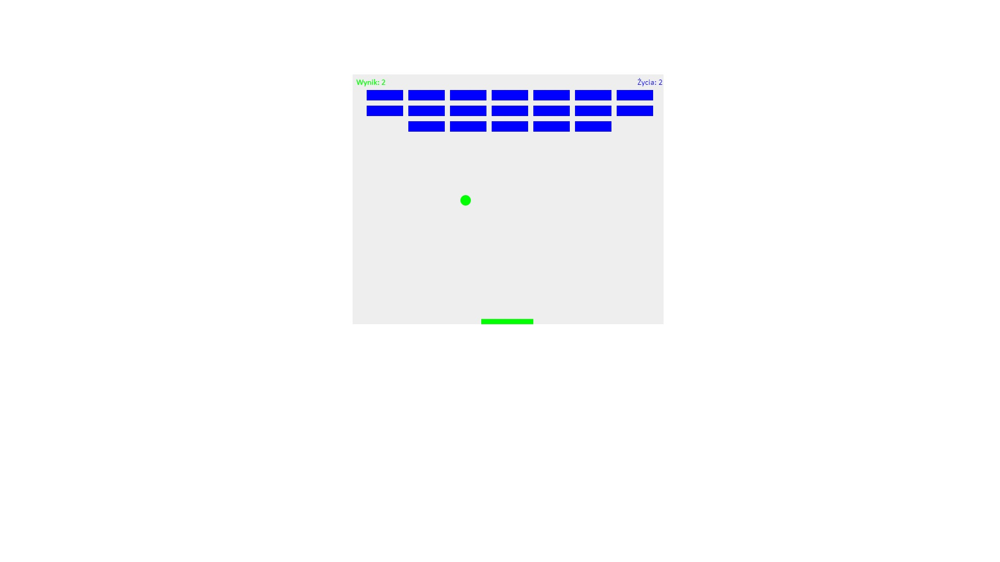

# Breakout-Game

## Table of contents
* [General info](#general-info)
* [Link to GitHub Pages](#link-to-gitHub-pages)
* [Screenshots](#screenshots)
* [Technologies](#technologies)
* [Status](#status)
* [Inspiration](#inspiration)

## General info
This Breakout 2D game was created while improving my practical skills in front-end web development during the "Web Design" training in which I participated.

## Link to GitHub Pages
https://annlemottien.github.io/Breakout-Game/

## Screenshots

## Technologies
Project is created with:
* JavaScript
* HTML
* CSS

## Status
Project is _in progress_

## Inspiration
Project inspired by: https://developer.mozilla.org/pl/docs/Games/Tutorials/2D_Breakout_game_pure_JavaScript

